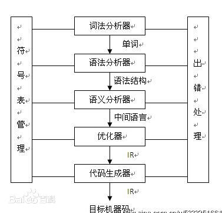
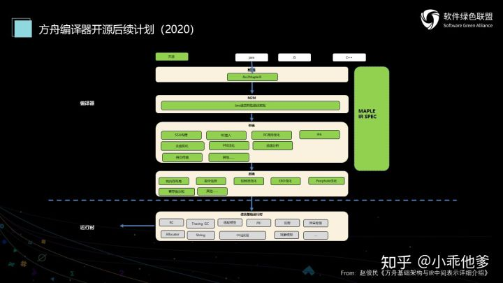
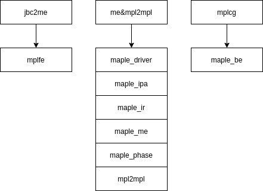

经典的编译器架构：  
  
&emsp;&emsp;其中词法语法语义统称为前段（front-end,fe），优化器称为终端（middle-end,me），代码生成叫后端（back-end,be）。全世界的编译器都长这样，方舟也不会例外。方舟架构表示如下：  


&emsp;&emsp;可以看到，最上面的前端就是我们在第一章使用的jbc2mpl这个工具，这个前段和传统意义的前段还不太一样。传统前段是从源代码文件转换到下一级的表示形式，而这里直接从java byte-code开始，这样这个前端很可能跳过了语法和语义部分，这些javac都已经做好了。
## 前端
### java2jar
&emsp;&emsp;方舟的最上层是java的源代码文件HelloWorld.java，然后经过一个脚本java2jar将HelloWorld.java转换为java byte-code文件HelloWorld.class以及打包后的HelloWorld.jar。java2jar的内容：
```
OUTPUT=$1
CORE_ALL_JAR=$2
shift 2
javac -g -d . -sourcepath ${CORE_ALL_JAR} $@
jar -cvf ${OUTPUT} *.class
```
&emsp;&emsp;这个脚本文件接受三个参数，一个是输出文件OUTPUT，第二个是java-core，然后跟着待编译的java文件。其实这个脚本直接利用了openjdk的javac和jar生成byte-code。所以形式上，javac目前就是方舟的前端了。
### jbc2mpl
&emsp;&emsp;jbc2mpl目前还没开源，这里不做深究，只看一下它的用处（开源目录中有个新的工程maplefe，应该是编译为一个lib，不知道jbc2mpl是不是用的它）。
```
jbc2mpl
========================================
 Usage: jbc2mpl [ options ]
 options:

  -h, -help              : print usage and exit
  -v, -version           : print version and exit
  -inclass file1.class,file2.class
                         : input class files
  -injar file1.jar,file2.jar
                         : input jar files
  -mplt file1.mplt,file2.mplt
                         : import mplt files
  -o, -out output.mpl    : output mpl name
  -output path           : output path
  -t                     : Generate mplt only
  -asciimplt             : Generate ascii mplt
  -use-string-factory    : Replace String.<init> by StringFactory call
```
&emsp;&emsp;看的出来，jbc2mpl接受刚刚编译出来的class文件或者jar文件作为输入，同时可以导入mplt文件作为链接的库文件，最终生成对应的mpl文件和mplt文件。jbc2mpl会将java byte-code转换为下一级的mapleIR。mapleIR和LLVMIR类似，有三种存在形式：文件形式，内存形式和可读形式。jbc2mpl生成了两个文件，其中HelloWorld.mpl文件保存了可读形式的mapleIR，读起来类似汇编代码；HelloWorld.mplt文件保存着mpl的声明（第三方资料，具体没有研究过）是一个二进制文件（所以说定义有没有二进制形式？）。同时还可以接受mplt文件的输入，可以看成链接的lib文件。
## 中端
### me&mpl2mpl
&emsp;&emsp;这两个都包含在maple中，但目前我也不是太清楚他们之间有什么区别，因为无论单独执行哪一个，似乎都会执行相同的phase sequence。从字面意思来说，先执行mpl2mpl，将较高级的语言相关IR转换为较低级的语言无关IR，然后执行me对低级IR进行优化。  
&emsp;&emsp;方舟的IR体系设计的十分有野心，一种IR中同时包含了多层的程序语义结构，既有接近高级语言的if，while，do-while之流，也有brtrue,brfalse这样的低级控制结构，这样可以减轻前段生成IR时的工作量，有利于执行一些适合于高级语法结构的优化，比如类型分析，同时也能更好的兼容各种不同的高级语言。当然高级语义是不利于分析和优化的，所以需要有将高级IR转换为低级IR的过程。
> Because any information in the source program may be useful for program analysis and optimization, MAPLE IR aims to provide information about the source program that is as complete as possible.  

&emsp;&emsp;一旦转换为低级的较为通用的IR后，便会执行me进行分析与优化，其中包含了模块级phase和函数级phase。
```
USAGE: maple [options]

  Example 1: <Maple bin path>/maple --run=me:mpl2mpl:mplcg --option="[MEOPT]:[MPL2MPLOPT]:[MPLCGOPT]"
                                    --mplt=MPLTPATH inputFile.mpl
  Example 2: <Maple bin path>/maple -O2 --mplt=mpltPath inputFile.dex

==============================
  Options:

  -h --help [COMPILERNAME]    	Print usage and exit.
                              	To print the help info of specified compiler,
                              	you can use jbc2mpl, me, mpl2mpl, mplcg... as the COMPILERNAME
                              	eg: --help=mpl2mpl

  --version [command]         	Print version and exit.

  --infile file1,file2,file3  	Input files.

  --mplt=file1,file2,file3    	Import mplt files.

  -O0                         	No optimization.

  -O2                         	Do more optimization. (Default)

  --gconly                     	Make gconly is enable
  --no-gconly                  	Don't make gconly is enable

  --me-opt                    	Set options for me

  --mpl2mpl-opt               	Set options for mpl2mpl

  --save-temps                	Do not delete intermediate files.
                              	--save-temps Save all intermediate files.
                              	--save-temps=file1,file2,file3 Save the
                              	target files.

  --run=cmd1:cmd2             	The name of executables that are going
                              	to execute. IN SEQUENCE.
                              	Separated by ":".Available exe names:
                              	jbc2mpl, me, mpl2mpl, mplcg
                              	Input file must match the tool can
                              	handle

  --option="opt1:opt2"      	Options for each executable,
                              	separated by ":".
                              	The sequence must match the sequence in
                              	--run.

  -time-phases                	Timing phases and print percentages

  --genmempl                  	Generate me.mpl file

  --genVtableImpl             	Generate VtableImpl.mpl file

  -verbose                    	: print informations

  --debug                     	Print debug info.

  --level=NUM                 	Print the help info of specified level.
                              	NUM=0: All options (Default)
                              	NUM=1: Product options
                              	NUM=2: Experimental options
                              	NUM=3: Debug options
```
&emsp;&emsp;命令行分为两种模式，一种是自动模式，类似于：
```
maple -O2 --mplt=mpltPath inputFile.dex
```
&emsp;&emsp;这种模式下只需要指定一个优化等级，程序会自动的帮你配置好me,mpl2mpl和mplcg的运行参数。第二种就是自己配置运行参数，可以更加精确的控制编译过程。  
&emsp;&emsp;**me的参数**：
+ --quiet：安静模式。
+ --O2：进行深度优化。

&emsp;&emsp;**mpl2mpl的参数**：
+ --quiet：安静模式。
+ --regnativefunc：
+ --maplelinker：
+ --emitVtableImpl：
+ --no-nativeopt：
## 后端
### mglcg
&&emsp;&emsp;生成时会将bin下的mplcg拷贝到output目录中，但实际上这个程序已经不再使用了。现在后端生成已经开源并包含在maple中，但华为还没有把这个程序挪走。

## 源码目录架构
+ bin：编译过的二进制文件。
+ deplibs：依赖库的二进制文件。
+ huawei_secure_c：华为自己的C标准库轮子。
+ maple_be：后端生成。
+ maple_driver：编译器的总体管理机制。
+ maple_ipa：过程间分析。
+ maple_ir：ir的定义。
+ maple_me：中端优化。
+ maple_phase：phase和phase manager的定义。
+ maple_utils：脚手架。
+ mempool：华为自己实现的内存池。
+ mpl2mpl：高级语义IR转换为通用IR。
+ mplfe：byte-code->MapleIR。

