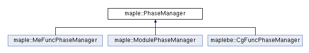

&emsp;&emsp;和很多编译器一样，方舟也需要根据任务需求和输入输出的格式来确定怎样引导编译流程的进行。这部分的功能实现主要在src/maple_driver中，部分分散在maple_ipa和maple_me中。
## CompilerFactory
&emsp;&emsp;CompilerFactory是一个单例工厂类，在构造函数中保存了所有的编译器。
``` cpp
CompilerFactory::CompilerFactory() {
  // Supported compilers
  ADD_COMPILER("jbc2mpl", Jbc2MplCompiler)
  ADD_COMPILER("me", MapleCombCompiler)
  ADD_COMPILER("mpl2mpl", MapleCombCompiler)
  ADD_COMPILER("mplcg", MplcgCompiler)
  compilerSelector = new CompilerSelectorImpl();
}
```
&emsp;&emsp;同时定义了一个方法Compile来根据所有的options驱动编译器的执行：
``` cpp
ErrorCode CompilerFactory::Compile(const MplOptions &mplOptions) {
  std::vector<Compiler*> compilers;

  // 根据参数选择需要执行的编译器
  ErrorCode ret = compilerSelector->Select(supportedCompilers, mplOptions, compilers);
  if (ret != kErrorNoError) {
    return ret;
  }

  // 依次执行所有的编译器
  for (auto *compiler : compilers) {
    if (compiler == nullptr) {
      LogInfo::MapleLogger() << "Failed! Compiler is null." << "\n";
      return kErrorCompileFail;
    }
    ret = compiler->Compile(mplOptions, this->theModule);
    if (ret != kErrorNoError) {
      return ret;
    }
  }
  // Compiler finished
  compileFinished = true;

  // 清理临时文件并返回
  ...
}
```
&emsp;&emsp;所以我们在main函数中看到，只是简单的解析了输入参数并执行单例的Compile方法。
``` cpp
int main(int argc, char **argv) {
  MplOptions mplOptions;
  // 解析命令行参数生成options
  int ret = mplOptions.Parse(argc, argv);
  if (ret == kErrorNoError) {
    // 执行CompilerFactory的Compile方法
    ret = CompilerFactory::GetInstance().Compile(mplOptions);
  }
  PrintErrorMessage(ret);
  return ret;
}
```
## CompilerSelector
&emsp;&emsp;这是一个接口类，用于选择需要执行的Compiler。目前他也只有一个继承CompilerSelectorImpl，位于src/maple_driver/compiler_selector.cpp中。这个类笔者感觉定义的很鸡肋，为什么要额外定义这样一个奇怪的东西？  
&emsp;&emsp;CompilerSelectorImpl中主要实现了Select方法，它会根据输入的参数和所有支持的编译器来确定实际需要执行的编译器。其实选择过程很简单，就是看输入的run参数中包含了哪些编译器。当然mpl和mpl2mpl对应了同一个编译器，其他的都对应他们各自的编译器。
``` cpp
ErrorCode CompilerSelectorImpl::Select(const SupportedCompilers &supportedCompilers, const MplOptions &mplOptions,
                                       std::vector<Compiler*> &selected) const {
  bool combPhases = false;
  if (!mplOptions.GetRunningExes().empty()) {
    // 遍历所有需要执行的编译器
    for (const std::string &runningExe : mplOptions.GetRunningExes()) {      
      if (runningExe == kBinNameMe) {
        // 如果是me，那么选择CombCompiler
        combPhases = true;
      } else if (runningExe == kBinNameMpl2mpl && combPhases) {
        // 如果是mpl2mpl，那么依然是CombCompiler
        continue;
      }
      // 插入编译器的实例
      ErrorCode ret = InsertCompilerIfNeeded(selected, supportedCompilers, runningExe);
      if (ret != kErrorNoError) {
        return kErrorToolNotFound;
      }
    }
  }
  return selected.empty() ? kErrorToolNotFound : kErrorNoError;
}
```


## Compiler
&emsp;&emsp;这是所有编译器的基类，定义了一些公共的接口，比如获取执行的程序路径，获取输入文件路径等等。其中比较重要的是Compile方法，它用于实际的编译过程执行。当然它有一个默认的实现，用于从参数中获取可执行文件路径并生成参数执行它。
``` cpp
ErrorCode Compiler::Compile(const MplOptions &options, MIRModulePtr&) {
  ...
  // 生成参数
  std::string strOption = MakeOption(options);
  if (strOption.empty()) {
    return kErrorInvalidParameter;
  }
  // 执行options中指定的可执行文件
  if (Exe(options, strOption) != 0) {
    return kErrorCompileFail;
  }
  ...
}
```
&emsp;&emsp;这个方法对应最普遍的一种情况，就是之前介绍的自动模式，自动模式生成详细的命令行参数后会在这里再次调用自身执行实际的编译过程。  
&emsp;&emsp;这是编译器比较普遍的一种模式，首先启动一个类似dispatcher的程序，将命令行参数指定的任务分解为一个个子任务并再次调用自身的子进程来分发具体的任务，由子进程来执行实际的编译过程。（在Exe的实现中看到了很期待的一段代码，方舟后面将会支持在windows上运行。）  

&emsp;&emsp;可以看到，指定O2后，会被分解为一个me&mpl2mpl和mplcg两个任务单独执行。  
&emsp;&emsp;一共有三个编译器继承了这个类，就是之前在CompilerFactory中添加的三个类：
+ Jbc2MplCompiler：jbc2mpl_compiler.cpp。这个类就直接使用了父类的Compile方法来调用jbc2mpl程序。
+ MapleCombCompiler：这是中端优化的实现类。
+ MplcgCompiler：这是后端生成的实现类。

    

## MapleCombCompiler
&emsp;&emsp;关于phase是如何drive的，官方的CompilerPhaseDescription.md中有一定的介绍。phase主要是在MapleCombCompiler和MplcgCompiler中被管理。这里我们先看MapleCombCompiler。
首先还是看Compile方法：
``` cpp
	ErrorCode MapleCombCompiler::Compile(const MplOptions& options, MIRModulePtr& theModule) {
    // 创建内存池
		MemPool* optMp = memPoolCtrler.NewMemPool("maplecomb mempool");
    // 获取输入文件
		std::string fileName = GetInputFileName(options);
		theModule = new MIRModule(fileName);
    // 分别填充me和mpl2mpl的options
		MeOption& meOptions = MeOption::GetInstance();
		Options& mpl2mplOptions = Options::GetInstance();
    ...

    //　创建DriverRUnner对象并执行其run方法
		DriverRunner runner(theModule, options.GetRunningExes(), &mpl2mplOptions, fileName, &meOptions,
			fileName, fileName, optMp,
			options.HasSetTimePhases(), options.HasSetGenVtableImpl(), options.HasSetGenMeMpl());
		ErrorCode nErr = runner.Run();

		memPoolCtrler.DeleteMemPool(optMp);
		return nErr;
	}
```
&emsp;&emsp;首先需要根据输入参数来生成所有的编译选项，当然没有在参数中的选项就设置为默认值。先来看下Me都有那些options：
+ kMeSkipPhases：跳过特定的phase，参数为一个字符串列表。
+ kMeOptL1：O1优化。
+ kMeOPtL2：O2优化。
+ kMeRange：仅优化某些函数，参数是一个整数列表？。
+ kSetCalleeHasSideEffect：让所有callee都具有副作用。
+ kNoSteensgaard：不进行Steensgaard别名分析。
+ kNoTBAA：不进行TBAA别名分析。
+ kAliasAnalysisLevel：自动确定进行那些别名分析。
+ ...（看到了再更新）

&emsp;&emsp;在分析完所有的options后，便会创建一个类DriverRunner对象并执行其中的run方法。从这里开始，中端优化才算是正式开始了。

## DriverRunner
> DriverRunner包含了从一个mpl文件到优化结果文件的所有过程。ParseInput方法负责解析mpl文件。ProcessMpl2mplAndMePhases方法通过InterleavedManager负责phase的管理和运行。  

&emsp;&emsp;Run方法中，首先会调用ParseIuput解析输入文件：
``` cpp
ErrorCode ret = ParseInput(outputFile, originBaseName);
if (ret != kErrorNoError) {
	return kErrorExit;
}
```
&emsp;&emsp;这是一个自顶向下的语法分析过程，但实际上MapleIR的格式都比较固定，没有什么灵活的语法结构，所以这个过程也十分的简单。然后执行ProcessMpl2mplAndMePhases来run所有的phase，phase执行完后执行ProcessCGPhase进行代码生成：
``` cpp
if (mpl2mplOptions != nullptr || meOptions != nullptr) {
	std::string vtableImplFile = originBaseName;
  // 生成输出文件的文件名
  // 这个保存的是经过phase处理后的ir
	vtableImplFile.append(".VtableImpl.mpl");
  // 这个用于代码生成，最后还会追加个.s表示是汇编文件
	originBaseName.append(".VtableImpl");
	ProcessMpl2mplAndMePhases(outputFile, vtableImplFile);
}
// code gen
ProcessCGPhase(outputFile, originBaseName);
```
## InterleavedManager
&emsp;&emsp;DriverRun主要通过ProcessMpl2mplAndMePhases来驱动所有的phase，而ProcessMpl2mplAndMePhases则是通过InterleavedManager来控制phase的执行顺序。  
&emsp;&emsp;一般在优化框架的设计中，首先需要根据不同pass的依赖关系做拓扑排序确定pass的执行顺序，比如phi-insertion需要依赖与domiance-tree，所以dominance-tree需要在phi-insertion之前执行。然后需要设计多层的pass manager，pass的执行不会是平坦的，比如alias-analysis中会有pointer-analysis和tbaa，那么这些alias分析的pass需要单独使用一个pass manager来驱动，与之类似的还有loop-analysis。然后，模块级的pass和函数级的pass也可能交替执行。最后，某些简单的pass可能会在反复调用，比如dce可以在每个pass执行完后都调用一次。  
&emsp;&emsp;正是因为pass执行的复杂性，需要有一个专门的管理器来驱动pass的执行。方舟中InterleavedManager就是这样一个角色（目前还不完善，和其他编译器比基本是小学生了）。
``` cpp
void DriverRunner::ProcessMpl2mplAndMePhases(const std::string& outputFile, const std::string& vtableImplFile) const {
   ...
	InterleavedManager mgr(optMp, theModule, meInput, timePhases);
	std::vector<std::string> phases;
#include "phases.def"
	InitPhases(mgr, phases);
	mgr.Run();
    ...
}
```
&emsp;&emsp;看这个类的字面意思就是不同的phase manager交替执行。所有需要执行的phas包含在“phases.def”文件中:
``` cpp
ADD_PHASE("clone", true)
ADD_PHASE("classhierarchy", true)
...
// mephase begin
ADD_PHASE("bypatheh", MeOption::optLevel == 2)
...
ADD_PHASE("emit", true)
// mephase end
ADD_PHASE("GenNativeStubFunc", true)
ADD_PHASE("clinit", true)
...
```
&emsp;&emsp;目前看pass的执行顺序还是手动的控制的。这里分为三个顺序执行的phase类，最上面的是module phase，中间的是function phase，下面的又是module phase，他们之间交替的执行着。  
&emsp;&emsp;InterleavedManager中保存着所有类型的phase-manager的实例，每个phase-manager中也保存着他们各自的所有phase，注意这时phase-manager的实例仅仅是起到分类的作用，并不是实际执行的phase-manager实例。然后在DriverRunner的InitPhases方法中会根据phases.def中的添加顺序依次创建对应的phase 
-manager实例并将phase添加到其中。最后会创建两个module phase manager和一个function phase manager。

## PhaseManager
&emsp;&emsp;PhaseManager用于管理某一类的所有phase，一共有三个类继承自它，包括ModulePhaseMnager和MeFunPhaseManager和CgFuncPhaseManager，分别用于模块级phase管理和函数级phase 管理。  
  

整个编译过程的drive：  
