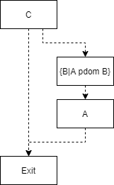

# me_dse：死代码消除
&emsp;&emsp;这是一个转换型phase，用于消除死代码。源码位于src/maple_me/src/me_dse.cpp。

## 死代码消除
&emsp;&emsp;SSA中的基本的死代码消除十分的简单，只需要判断一个def是否有use即可。如果只有def没有use，那这个def自然是没有用的，这是编译原理理论里常见的方法。但这是一种乐观算法，它先假定所有的语句都是存活的，然后去找死去的语句。  
&emsp;&emsp;在《Effciently computing static single assignment form and the control dependence graph》中引出了一种悲观算法，它预先假定所有语句和基本块都是死亡的，然后标识带副作用的语句以及他们的操作数为存活，然后将存活信息沿着UD链传递到整个控制流。同时还将存活语句的基本块以及该基本块的控制依赖都标识为存活。控制依赖就是反向流图的支配边界，如果$A\in{DF_{pdom}(B)}$，那么说B control dependent on A。从图上来讲就是，A的最后一条语句是一个分支指令，其中一个分支的后继S->B的路径上所有节点都节点都被B后支配，但另一个分支到exit可以不经过B，我们不能尝试将这个分支指令优化为goto指令，这样会导致语义上的错误（B中的语句要么必然执行要么无法得到执行），所以如果B存活那么明显A也就必然是存活的。  
&emsp;&emsp;下图中A control depentent on C：  


## MeDoDSE
&emsp;&emsp;MeDoDSE只是调用了几个相关类的接口：
``` cpp
AnalysisResult* MeDoDSE::Run(MeFunction* func, MeFuncResultMgr* m, ModuleResultMgr*) {
  CHECK_NULL_FATAL(func);
  // 获取MeDoDominance的分析结果
  auto* postDom = static_cast<Dominance*>(m->GetAnalysisResult(MeFuncPhase_DOMINANCE, func));
  CHECK_NULL_FATAL(postDom);
  MeDSE dse(*func, postDom, DEBUGFUNC(func));
  // 执行DSE
  dse.RunDSE();
  func->Verify();
  // 如果有BB被删除，将MeDoDominance的结果删除
  if (dse.UpdatedCfg()) {
    m->InvalidAnalysisResult(MeFuncPhase_DOMINANCE, func);
  }
  return nullptr;
}

void MeDSE::RunDSE() {
  if (enableDebug) {
    func.Dump(true);
  }
  // 执行DSE
  DoDSE();
  // 删除不可达代码
  func.GetTheCfg()->UnreachCodeAnalysis(true);
  // 检查删除过后phi是否还正常
  VerifyPhi();
  if (enableDebug) {
    func.Dump(true);
  }
}
```
&emsp;&emsp;主要算法实在DSE类中实现。

## DSE
### 初始化
``` cpp
// 标记入口和出口节点为存活
void DSE::Init() {
  bbRequired[commonEntryBB.GetBBId()] = true;
  bbRequired[commonExitBB.GetBBId()] = true;
}

void DSE::DoDSE() {
  Init();
  // 标记必须存活的语句
  MarkSpecialStmtRequired();
  // 传播存活信息
  PropagateLive();
  // 删除死代码
  RemoveNotRequiredStmts();
}
```
### 标记必须存活语句
&emsp;&emsp;第一步是标记必须存活语句，哪些语句必须存活呢？常规的，所有的call语句以及会产生异常语句这种肯定是存活的，因为他们都可能会有副作用。带violate属性的语句以及带barrier的语句也是不能删除的，他们都会影响到代码生成的顺序。方舟中还有些额外的语句也是存活的，比如RC相关的语句和SYNC相关的语句。可以看StmtMustRequired的定义：
``` cpp
bool DSE::StmtMustRequired(const StmtNode& stmt, const BB& bb) const {
  Opcode op = stmt.GetOpCode();
  // 从Opcode决定是否存活
  if (IsStmtMustRequire(op)) {
    return true;
  }

  // 无限循环中的控制流指令
  if (ControlFlowInInfiniteLoop(bb, op)) {
    return true;
  }

  // 是否有不可删除的操作数
  return HasNonDeletableExpr(stmt);
}
```
#### 存活指令
&emsp;&emsp;这些都在opcodes.h的IsStmtMustRequire中定义。
``` cpp
constexpr bool IsStmtMustRequire(Opcode opcode) {
  switch (opcode) {
    case OP_jstry:
    ... //异常处理
    case OP_retsub:
    case OP_return:
    case OP_call:
    case OP_callassigned:
    ... // 各种call和assigne
    case OP_syncenter:
    case OP_syncexit:
    case OP_membaracquire:
    ... // 各种barrier
    case OP_assertnonnull:
    case OP_eval:
    case OP_free:
    case OP_incref:
    case OP_decref:
    case OP_decrefreset: {
      return true;
    }
    default:
      return false;
  }
}
```
#### 无限循环
&emsp;&emsp;无限循环中的控制流指令也不能删除。比如消息循环，事件处理等等，这些无限循环的代码块没有到出口的边，也就不存在于反向支配树中，因此他们没有控制依赖。但又不能删除，所以这里直接把他们标记为存活好了。
#### 语句的操作数
&emsp;&emsp;最后判断操作数是不是volatile或者指令具有副作用。volatile是需要阻止优化的，而有副作用的语句也不能删除。
``` cpp
bool DSE::HasNonDeletableExpr(const StmtNode& stmt) const {
  Opcode op = stmt.GetOpCode();
  switch (op) {
  case OP_dassign: {
  auto& node = static_cast<const DassignNode&>(stmt);
    const MIRSymbol& sym = ssaTab.GetStmtMIRSymbol(stmt);
    // 如果assign目标有volatile属性
    // 或者目标字段有volatile属性
    // 或者右手表达式不能删除
    return (sym.IsVolatile() || sym.IsTypeVolatile(node.GetFieldID()) ||
      ExprNonDeletable(ToRef(node.GetRHS())));
  }
  case OP_regassign: {
    // 右手表达式不能删除
    return ExprNonDeletable(ToRef(stmt.Opnd(0)));
  }
  // possible to throw exception
  case OP_maydassign: {
    return true;
  }
  case OP_iassign: {
    auto& node = static_cast<const IassignNode&>(stmt);
    auto& ty = static_cast<const MIRPtrType&>(GetTypeFromTyIdx(node.GetTyIdx()));
    // 指向的字段有volatile属性或者左右手表达式均不能被删除
    return (ty.IsPointedTypeVolatile(node.GetFieldID()) ||
      ExprNonDeletable(ToRef(node.Opnd(0))) ||
      ExprNonDeletable(ToRef(node.GetRHS())));
  }
  default:
    return false;
  }
}
```

&emsp;&emsp;这样就将必须存活的语句标记下来了，总结一下：
+ call语句
+ 死循环的控制流语句
+ 带副作用的语句
+ 有volatile属性操作数的语句

### 放入工作队列
&emsp;&emsp;如果一个语句已经被标记为存活，那么它的所有操作数也要被标记为存活。然后迭代的将所有存活语句放到Worklist中。  
&emsp;&emsp;不过方舟这里处理的不太一样，它会将所有必须存活语句的leaf node迭代的保存到工作队列中，这里的leaf node就是一个SSA变量的某个version。然后在工作队列算法中将这些leaf node的def语句标记为存活。这当然也很好理解，但不太直观，在LLVM中，某个变量（virtual register）会直接指向其def语句，而方舟中会通过SymbolTable中的Index来索引。
``` cpp
void DSE::MarkStmtUseLive(const StmtNode& stmt) {
 // 将所有的leaf node放到工作队列中
  for (size_t i = 0; i < stmt.NumOpnds(); ++i) {
    MarkSingleUseLive(ToRef(stmt.Opnd(i)));
  }

  // 所有这个结点可能会访问的变量也放到工作队列，他们也视为存活
  if (kOpcodeInfo.HasSSAUse(stmt.GetOpCode())) {
    for (auto& pair : ssaTab.GetStmtMayUseNodes(stmt)) {
      const MayUseNode& mayUse = pair.second;
     AddToWorkList(mayUse.GetOpnd());
   }
  }
}
```

### 标记控制依赖的存活
&emsp;&emsp;当然不要忘记了，如果一个语句存活的话，那么它所属的基本块也是存活的。同时这个基本块的所有控制依赖的基本块以及这些基本块的最后一条分支语句也是存活的。
``` cpp
void DSE::MarkControlDependenceLive(const BB& bb) {
  // 当前块标记为存活
  if (bbRequired[bb.GetBBId()]) {
    return;
  }
  bbRequired[bb.GetBBId()] = true;

  // 当前块的最后一条是分支指令，也保留(？？为什么，感觉没必要)
  MarkLastBranchStmtInBBRequired(bb);
  // 控制依赖块中的最后一条分支语句存活
  MarkLastBranchStmtInPDomBBRequired(bb);
  // 前继块中的非条件跳转语句放到工作队列（条件跳转不一定存活，因为条件跳转可以被优化为非条件跳转）
  MarkLastGotoInPredBBRequired(bb);
}
```
&emsp;&emsp;到这里为止，第一阶段就完成了，该标记的都标记了，下一步就开始传播这些存活信息了。

### 传播存活信息
&emsp;&emsp;用一个工作队列算法来执行传播：
``` cpp
void PropagateLive() {
  while (!workList.empty()) {
    auto vst = workList.front();
    workList.pop_front();
    PropagateUseLive(*vst);
  }
}
```
&emsp;&emsp;这时工作队列里都是leaf node，在SSA中就是变量的某个版本，需要将这个版本的def语句标记存活并将def语句中的leaf node再次加入到WorkList中直到队列为空。
``` cpp
void DSE::PropagateUseLive(const VersionSt& vst) {
    // 首先将表达式标记为存活，这个是一个leaf node
	if (IsSymbolLived(vst)) {
		return;
	}
	SetSymbolLived(vst);
	const BB* dfBB = vst.GetDefBB();
	if (dfBB == nullptr) {
		return;
	}
	if (vst.GetDefType() == VersionSt::kAssign) {
        // assign语句
		const StmtNode* assign = vst.GetAssignNode();
		MarkStmtRequired(ToRef(assign), ToRef(dfBB));
	}
	else if (vst.GetDefType() == VersionSt::kPhi) {
        // phi语句
		const PhiNode* phi = vst.GetPhi();
		ASSERT(phi->GetResult() == &vst, "MarkVst: wrong corresponding version st in phi");
		MarkControlDependenceLive(ToRef(dfBB));
		for (size_t i = 0; i < phi->GetPhiOpnds().size(); ++i) {
			const VersionSt* verSt = phi->GetPhiOpnds()[i];
			AddToWorkList(verSt);
		}
	}
	else if (vst.GetDefType() == VersionSt::kMayDef) {
		const MayDefNode* mayDef = vst.GetMayDef();
		ASSERT(mayDef->GetResult() == &vst, "MarkVst: wrong corresponding version st in maydef");
		const VersionSt* verSt = mayDef->GetOpnd();
		MarkStmtRequired(ToRef(mayDef->GetStmt()), ToRef(dfBB));
		AddToWorkList(verSt);
	}
	else {
		const MustDefNode* mustDef = vst.GetMustDef();
		ASSERT(mustDef->GetResult() == &vst, "MarkVst: wrong corresponding version st in mustDef");
		MarkStmtRequired(ToRef(mustDef->GetStmt()), ToRef(dfBB));
	}
}
```
### 清除死代码
&emsp;&emsp;所有的存活代码都得到了标记，那么没标记的代码和基本块就可以被清除了。注意如果基本块被清除或者条件分支优化为非条件分支，那么流图就会发生改变，之前所有生成的支配树和前后序序列也就失效了。
``` cpp
void RemoveNotRequiredStmts() {
  for (auto bIt = bbVec.begin(); bIt != bbVec.end(); ++bIt) {
    auto* bb = *bIt;
    if (bb == nullptr) {
      continue;
    }
    RemoveNotRequiredStmtsInBB(*bb);
  }
}

void DSE::RemoveNotRequiredStmtsInBB(BB& bb) {
  for (auto& stmt : bb.GetStmtNodes()) {
    if (!IsStmtRequired(stmt)) {
      // 从条件跳转转化为非条件跳转
      OnRemoveBranchStmt(bb, stmt);
      // 从bb中删除该语句
      bb.RemoveStmtNode(&stmt);
      continue;
    }
    // 不晓得再干嘛
    CheckRemoveCallAssignedReturn(stmt);
  }
}
```

### 扫尾工作
&emsp;&emsp;所有死代码都删除完毕之后，DSE类的使命就结束了。但这时候还有死块没有被删除，这个功能是通过MeCFG类的UnreachCodeAnalysis完成的。UnreachCodeAnalysis通过执行一次dfs找到所有可达BB的集合。然后遍历函数中的所有BB，如果该BB不在可达基本块中，那就需要将该基本块删除。其中还有一些其他需要考虑的地方，方舟在这里还考虑的Try块和PHI节点的修正。