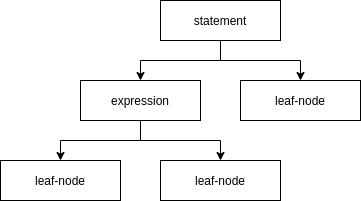
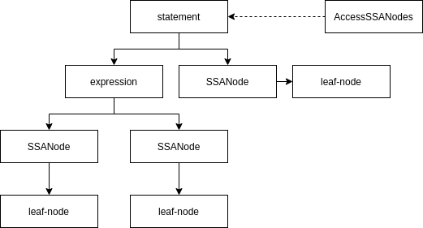
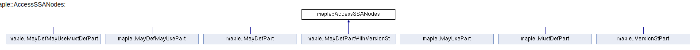
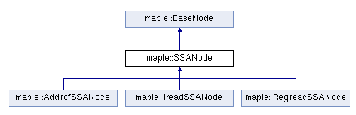

# me_ssa_tab：SSA结构创建
&emsp;&emsp;这是一个转换型phase，用于生成MapleIR的SSA信息。源码位于src/maple_me/src/me_ssa_tab.cpp。

## MapleIR与SSA
&emsp;&emsp;在LLVM中，LLVMIR本身就是SSA格式的。在一开始生成LLVMIR后，虽然没有PHI节点，但仍然遵循着single assign的原则，而use和def都包含在load和store指令中。这时的LLVMIR其实不是严格意义的SSA，需要经过后续的mem2reg，将load和store转换为pesudo register后，才算是真正意义上的SSA格式（其实仍然不完全算）。这时的LLVMIR就是SSA。  
&emsp;&emsp;MapleIR不同与这种形式。MapleIR本身是树形结构，类似于表达式树，虽然在后续的优化和生成过程中这个树会越来越平，但天生的设计决定了它无法表达SSA信息。因此这时SSA信息保存在另一个载体中，叫做ssa-table，每一个statement（一棵树）对应一个AccessSSANodes并保存在ssa-table中。但也不是所有的信息都保存在ssa-table中的，树中的leaf-node会被替换为对应的SSA节点而不会保存到ssa-table中。

## 这个phase的效果示意图
转换前



转换后



## AccessSSANodes
&emsp;&emsp;所有可能会产生def效果的statement都会生成一个AccessSSANodes。SSATab中有一个map会建立statement-id到AccessSSANodes的映射。一共用七种SSA的node继承自AccessSSANodes。
+ MayDefMayUseMustDefPart：可能use一些变量，可能def一些变量，但有必然会def的变量。主要用于callassign，因为函数内部实现不清楚，因此def和use都不知道，但返回值的assign必然是def的。
+ MayDefMayUsePart：可能use一些变量，可能def一些变量。这个就是普通的call了。
+ MayDefPart：可能会def一些变量。iassign就是这样的。
+ MayDefPartWithVersionSt：其实就是def。但这个def可能会失效。
+ ...后面都差不多这意思



## SSANode
&emsp;&emsp;所有的会产生use效果的leaf-node都会生成一个SSANode。这个不会被保存到SSATab中，而是直接将原node替换掉。一共有三种SSANoded的继承。
+ AddrofSSANode：从内存读取值。
+ IreadSSANode：间接访存。
+ RegreadSSANOde：从寄存器读取值。



## MeDoSSATab
&emsp;&emsp;这个类便利所有的statement并生成SSA信息。
``` cpp
for (auto bIt = func->valid_begin(); bIt != func->valid_end(); ++bIt) {
  auto *bb = *bIt;
  for (auto &stmt : bb->GetStmtNodes()) {
    ssaTab->CreateSSAStmt(stmt); // this adds the SSANodes for exprs
  }
}
```

## CreateSSAStmt
``` cpp
void SSATab::CreateSSAStmt(StmtNode &stmt) {
  // 这一步是将leaf-node替换为包裹其的SSANode
  for (size_t i = 0; i < stmt.NumOpnds(); ++i) {
    BaseNode *newOpnd = CreateSSAExpr(*stmt.Opnd(i));
    if (newOpnd != nullptr) {
      stmt.SetOpnd(newOpnd, i);
    }
  }
  switch (stmt.GetOpCode()) {
  case OP_maydassign:
  case OP_dassign: {
    // 生成一个MayDefPartWithVersionSt节点并保存在stmtsSSAPart
    MayDefPartWithVersionSt *theSSAPart =
        stmtsSSAPart.GetSSAPartMp()->New<MayDefPartWithVersionSt>(
            &stmtsSSAPart.GetSSAPartAlloc());
    stmtsSSAPart.SetSSAPartOf(stmt, theSSAPart);
    // 获取初始版本的变量
    auto &dNode = static_cast<DassignNode &>(stmt);
    MIRSymbol *st =
        mirModule.CurFunction()->GetLocalOrGlobalSymbol(dNode.GetStIdx());
    CHECK_FATAL(st != nullptr, "null ptr check");

    OriginalSt *ost = FindOrCreateSymbolOriginalSt(
        *st, mirModule.CurFunction()->GetPuidx(), dNode.GetFieldID());
    VersionSt *vst = versionStTable.FindOrCreateVersionSt(ost, kInitVersion);

    // 保存该版本的变量到MayDefPartWithVersionSt中
    theSSAPart->SetSSAVar(*vst);
    // if the rhs may throw exception, we insert MayDef of the lhs var
    if (stmt.GetOpCode() == OP_maydassign) {
      theSSAPart->InsertMayDefNode(theSSAPart->GetSSAVar(), &dNode);
    }
    return;
  }
  case OP_regassign: {
    // 道理同上
    auto &regNode = static_cast<RegassignNode &>(stmt);
    OriginalSt *ost = originalStTable.FindOrCreatePregOriginalSt(
        regNode.GetRegIdx(), mirModule.CurFunction()->GetPuidx());
    VersionSt *vst = versionStTable.FindOrCreateVersionSt(ost, kInitVersion);
    stmtsSSAPart.SetSSAPartOf(stmt, vst);
    return;
  }
  // ... 基本同上
  default: {
    if (kOpcodeInfo.IsCallAssigned(stmt.GetOpCode())) {
      // callassigned对应MayDefMayUseMustDefPart节点
      MayDefMayUseMustDefPart *theSSAPart =
          stmtsSSAPart.GetSSAPartMp()->New<MayDefMayUseMustDefPart>(
              &stmtsSSAPart.GetSSAPartAlloc());
      stmtsSSAPart.SetSSAPartOf(stmt, theSSAPart);
      // insert the mustdefs
      auto *nrets = static_cast<NaryStmtNode &>(stmt).GetCallReturnVector();
      CHECK_FATAL(nrets != nullptr,
                  "CreateSSAStmt: failed to retrieve call return vector");
      if (nrets->empty()) {
        return;
      }
      // 将所有返回值的初始版本加入到MuseDef数组中
      for (CallReturnPair &retPair : *nrets) {
        if (!retPair.second.IsReg()) {
          StIdx stidx = retPair.first;
          MIRSymbolTable *symTab = mirModule.CurFunction()->GetSymTab();
          MIRSymbol *st = symTab->GetSymbolFromStIdx(stidx.Idx());
          OriginalSt *ost = FindOrCreateSymbolOriginalSt(
              *st, mirModule.CurFunction()->GetPuidx(),
              retPair.second.GetFieldID());
          VersionSt *vst =
              versionStTable.FindOrCreateVersionSt(ost, kInitVersion);
          theSSAPart->InsertMustDefNode(vst, &stmt);
        } else {
          ASSERT(false, "NYI");
        }
      }
    } else if (kOpcodeInfo.IsCall(stmt.GetOpCode())) {
      stmtsSSAPart.SetSSAPartOf(
          stmt, stmtsSSAPart.GetSSAPartMp()->New<MayDefMayUsePart>(
                    &stmtsSSAPart.GetSSAPartAlloc()));
    }
  }
  }
}
```

## CreateSSAExpr
``` cpp
BaseNode *SSATab::CreateSSAExpr(BaseNode &expr) {
  if (expr.GetOpCode() == OP_addrof || expr.GetOpCode() == OP_dread) {
    if (expr.IsSSANode()) {
      return mirModule.CurFunction()->GetCodeMemPool()->New<AddrofSSANode>(
          static_cast<AddrofSSANode &>(expr));
    }
    // 为addrof和opread创建AddrofSSANode，dread虽然是expression但它本质也只是一个AddrofNode
    auto &addrofNode = static_cast<AddrofNode &>(expr);
    AddrofSSANode *ssaNode =
        mirModule.CurFunction()->GetCodeMemPool()->New<AddrofSSANode>(
            addrofNode);
    MIRSymbol *st =
        mirModule.CurFunction()->GetLocalOrGlobalSymbol(ssaNode->GetStIdx());
    OriginalSt *ost = FindOrCreateSymbolOriginalSt(
        *st, mirModule.CurFunction()->GetPuidx(), ssaNode->GetFieldID());
    VersionSt *vst = versionStTable.FindOrCreateVersionSt(ost, kInitVersion);
    ssaNode->SetSSAVar(*vst);
    return ssaNode;
  } else if (expr.GetOpCode() == OP_regread) {
    // 为regread创建RegreadNode
    auto &regReadNode = static_cast<RegreadNode &>(expr);
    RegreadSSANode *ssaNode =
        mirModule.CurFunction()->GetCodeMemPool()->New<RegreadSSANode>(
            regReadNode);
    OriginalSt *ost = originalStTable.FindOrCreatePregOriginalSt(
        ssaNode->GetRegIdx(), mirModule.CurFunction()->GetPuidx());
    VersionSt *vst = versionStTable.FindOrCreateVersionSt(ost, kInitVersion);
    ssaNode->SetSSAVar(*vst);
    return ssaNode;
  } else if (expr.GetOpCode() == OP_iread) {
    // 为iread创建IreadNode
    auto &ireadNode = static_cast<IreadNode &>(expr);
    IreadSSANode *ssaNode =
        mirModule.CurFunction()->GetCodeMempool()->New<IreadSSANode>(ireadNode);
    BaseNode *newOpnd = CreateSSAExpr(*ireadNode.Opnd(0));
    if (newOpnd != nullptr) {
      ssaNode->SetOpnd(newOpnd, 0);
    }
    return ssaNode;
  }
  // 如果表达式不是leaf-node，看看其操作数是否是leaf-node
  for (size_t i = 0; i < expr.NumOpnds(); ++i) {
    BaseNode *newOpnd = CreateSSAExpr(*expr.Opnd(i));
    if (newOpnd != nullptr) {
      expr.SetOpnd(newOpnd, i);
    }
  }
  return nullptr;
}
```

## 结束
&emsp;&emsp;结果这个phase的转换，实际上是形成了一个隐形的SSA的图结构，类似于LLVM中的那种表达。但不同的是，不会产生def的语句将不会出现在这个图中（但其中的操作数还是会在图中的）。