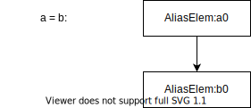
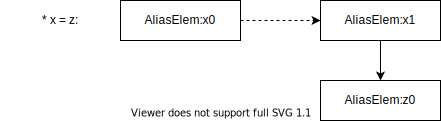
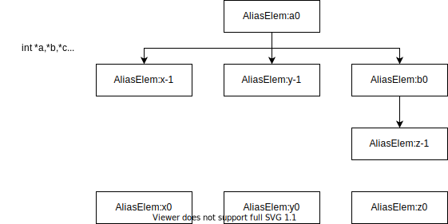
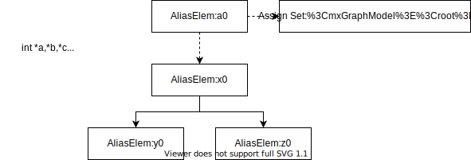

# me_alias_class：别名分析（一）
&emsp;&emsp;这是一个分析型analysis，用于别名。源码位置位于src/maple_me/me_alias_class.cpp

## 别名分析
&emsp;&emsp;别名分析用于查询两个指针是否指向同一个对象，这是一个相对比较有难度的分析。如果a = &x, b = &x，那么说a和b互为别名，这样对a的写入很可能会影响到b。从方式上分类，一般包括上下文敏感分析和上下文不敏感分析，流敏感和流不敏感分析，以及整体分析和需求驱动分析。有兴趣的可以看最近B站上南大软件分析课程中的Points-To Analysis。  
&emsp;&emsp;别名分析的基础是指针分析，确定所有指针指向对象的集合。这个可以参看论文《Points-to Analysis in Almost Linear Time》。
另外还有更进一步的基于类型的别名分析，这个在论文《Type-Based Alias Analysis》中有介绍（这个我还没看，所以分了两篇来写:-D）。方舟中的指针分析是上下文不敏感流不敏感的整体分析，精确度有Steensgaard Points-To和TBAA两种分析。  
&emsp;&emsp;LLVM中alias analysis作为一个分析型pass会有一个查询接口在其他pass需要确定两个指针是否互为别名时提供查询。但方舟中会有所不同。

## MeAliasClass::DoAliasAnalysis
&emsp;&emsp;别名分析的整体框架在这个方法中实现，首先会分析程序中所有可能的赋值，将赋值的LHS和RHS关联起来。这个赋值是没有指针属性的，也就是说指针赋值或者变量赋值都会包含在其中。
``` cpp
for (auto bIt = func.valid_begin(); bIt != func.valid_end(); ++bIt) {
  for (auto &stmt : (*bIt)->GetStmtNodes()) {
    // 将所有赋值关系关联起来
    ApplyUnionForCopies(stmt);
  }
}
```
&emsp;&emsp;这里的分析过程会使用并查集，每个赋值目标作为根节点。树上的节点都是可能被赋值的对象。  
&emsp;&emsp;第二步会在这里给每个根对象创建一个assign set，将被赋值对象的ID放到assign set中，并查集被销毁：
``` cpp
// 创建assign set
CreateAssignSets();
// 销毁并查集，后面还要使用
ReinitUnionFind();
```
&emsp;&emsp;第三步是进行指针分析，这里会根据命令行参数决定是否进行指针分析。如果不进行指针分析，会将所有指针合到一棵树中，既程序中的所有指针互为别名，否则执行Steensgaard Points-To分析：
``` cpp
if (MeOption::noSteensgaard) {
  UnionAllPointedTos();
} else {
  ApplyUnionForPointedTos();
  UnionForNotAllDefsSeen();
}
```
&emsp;&emsp;第四步是进行基于类型的别名分析：
``` cpp
  // TBAA
  if (!MeOption::noTBAA && mirModule.IsJavaModule()) {
    ReconstructAliasGroups();
  }
```
&emsp;&emsp;上面一个指针分析一个TBAA基本将互为别名的指针都分隔开来了，下面为互为别名的指针创建别名类：
``` cpp
CreateClassSets();
```
&emsp;&emsp;最后一步就是将刚刚分析得到的别名信息插入到SSA节点中：
``` cpp
for (auto bIt = func.valid_begin(); bIt != func.valid_end(); ++bIt) {
  auto *bb = *bIt;
  for (auto &stmt : bb->GetStmtNodes()) {
    GenericInsertMayDefUse(stmt, bb->GetBBId());
  }
}
```
## 第一步：赋值语句分析

#### ApplyUnionForCopies
&emsp;&emsp;ApplyUnionForCopies函数会分析所有的赋值语句，对每一个对象创建一个AliasElem，并将赋值语句的LHS和RHS的AliasElem插入的并查集中。  
&emsp;&emsp;首先是直接赋值语句，比如a = b这种，为a和b分别创建AliasElem，然后将两个AliasElem插入的并查集树中：


``` cpp
  case OP_maydassign:
  case OP_dassign:
  case OP_regassign: {
    // 创建RHS的AliasElem
    AliasElem *rhsAe = CreateAliasElemsExpr(*stmt.Opnd(0));
    // 创建LHS的AliasElem
    OriginalSt *ost =
        ssaTab.GetStmtsSSAPart().GetAssignedVarOf(stmt)->GetOrigSt();
    AliasElem *lhsAe = FindOrCreateAliasElem(*ost);
    // 合并到并查集树中
    ApplyUnionForDassignCopy(*lhsAe, rhsAe, *stmt.Opnd(0));
    return;
  }
```
&emsp;&emsp;然后是间接赋值语句，比如*a = b指针，这时需要创建一个虚拟的变量c，令a = &c（可以看steensgaard的论文）。需要为a，b，c都创建AliasElem，其中a是指针类型，指向的类型和b与c的类型相同。


``` cpp
  case OP_iassign: {
    auto &iassignNode = static_cast<IassignNode &>(stmt);
    // 创建RHS的AliasElem
    AliasElem *rhsAliasElem = CreateAliasElemsExpr(*iassignNode.Opnd(1));
    // 为LHS创建虚拟变量c并返回c的AliasElem
    AliasElem *lhsAliasElem = FindOrCreateExtraLevAliasElem(
        *iassignNode.Opnd(0), iassignNode.GetTyIdx(), iassignNode.GetFieldID());
    // 将RHS和c的AliasElem合并到并查集树中
    ApplyUnionForDassignCopy(*lhsAliasElem, rhsAliasElem, *iassignNode.Opnd(1));
    return;
  }
```
&emsp;&emsp;下面还有一些分支，不过基本和上面雷同。下面是给所有操作数创建AliasElem：
``` cpp
  default:
    // 给所有操作数创建AliasElem
    for (size_t i = 0; i < stmt.NumOpnds(); ++i) {
      CreateAliasElemsExpr(*stmt.Opnd(i));
    }
  }
  // 通过callassign来def的变量设置def不可见属性，因为def在函数中
  if (kOpcodeInfo.IsCallAssigned(stmt.GetOpCode())) {
    SetNotAllDefsSeenForMustDefs(stmt);
  }
```

#### FindOrCreateAliasElem

&emsp;&emsp;这个函数中创建对象的AliasELem。  
&emsp;&emsp;这里有个名词需要解释下，方舟中的指针层级叫做IndirectLevel，如果是-1表示对IndirectLevel修饰的变量进行取址操作，就是c语言中的&x，如果是0表示对象自身，即x，大于一表示dereference的次数，既*x,**x...
``` cpp
AliasElem *AliasClass::FindOrCreateAliasElem(OriginalSt &ost) {
  OStIdx ostIdx = ost.GetIndex();
  AliasElem *aliasElem = osym2Elem[ostIdx];
  // 已经有该对象的AliasELem项，直接返回
  if (aliasElem != nullptr) {
    return aliasElem;
  }
  // 创建新的AliasELem
  aliasElem = acMemPool.New<AliasElem>(id2Elem.size(), ost);
  if (ost.IsSymbolOst() && ost.GetIndirectLev() >= 0) {
    const MIRSymbol *sym = ost.GetMIRSymbol();
    // 这里处理的不太明白，好像是一个JAVA语言的特性，全局变量会被一个内置的过程修改
    if (sym->IsGlobal() && !sym->HasAddrOfValues() && !sym->GetIsTmp()) {
      globalsMayAffectedByClinitCheck.insert(ostIdx);
      if (!sym->IsReflectionClassInfo()) {
        if (!ost.IsFinal() || InConstructorLikeFunc()) {
          globalsAffectedByCalls.insert(aliasElem->GetClassID());
        }
        aliasElem->SetNextLevNotAllDefsSeen(true);
      }
    }
  }
  // 如果对函数形参进行了dereference，那么我们是不是知道dereference后的值是多少的
  if (aliasElem->GetOriginalSt().IsFormal() || ost.GetIndirectLev() > 0) {
    aliasElem->SetNextLevNotAllDefsSeen(true);
  }
  // 记录该AliasElem
  id2Elem.push_back(aliasElem);
  osym2Elem[ostIdx] = aliasElem;
  // 将该AliasElem设置为一颗树的root。在创建过程中每个新节点都单独放一棵树中。
  // 后面会执行Union的过程
  unionFind.NewMember();
  return aliasElem;
}
```

#### FindOrCreateExtraLevAliasElem

&emsp;&emsp;上面说过对于间接赋值，需要创建一个虚拟指针对象，这个过程就在FindOrCreateExtraLevAliasElem中实现。如果地址表达式是*x，那么创建新对象y = &x，这样如果原来的表达式是*x = z，就变成了y = z，所以这个函数返回的是新对象y的AliasElem。让y的AliasElem和z的AliasElem一起插入到并查集中。
``` cpp
AliasElem *AliasClass::FindOrCreateExtraLevAliasElem(BaseNode &expr,
                                                     TyIdx tyIdx,
                                                     FieldID fieldId) {
  // 首先给取址表达式*x创建AliasElem
  AliasElem *aliasElem = CreateAliasElemsExpr(
      kOpcodeInfo.IsTypeCvt(expr.GetOpCode()) ? *expr.Opnd(0) : expr);
  if (aliasElem == nullptr) {
    return nullptr;
  }
  // 创建一个新的表达式表示y = &x，newOst表示y对象
  OriginalSt *newOst = GetAliasAnalysisTable()->FindOrCreateExtraLevOriginalSt(
      aliasElem->GetOriginalSt(), tyIdx, fieldId);
  if (newOst->GetIndex() == osym2Elem.size()) {
    osym2Elem.push_back(nullptr);
    // 给这个新对象创建一个version，暂时不太清楚这一步的含义
    ssaTab.GetVersionStTable().CreateVersionSt(newOst, kInitVersion);
  }
  // 返回新对象的AliasElem
  return FindOrCreateAliasElem(*newOst);
}
```

#### ApplyUnionForDassignCopy

&emsp;&emsp;将刚刚LHS和RHS返回的两个AliasElem合并到一棵并查集树中：
``` cpp
void AliasClass::ApplyUnionForDassignCopy(const AliasElem &lhsAe,
                                          const AliasElem *rhsAe,
                                          const BaseNode &rhs) {
  // 如果RHS并不好表示的话，就给LHS一个def不可见属性
  if (rhsAe == nullptr || rhsAe->GetOriginalSt().GetIndirectLev() > 0 ||
      rhsAe->IsNotAllDefsSeen()) {
    AliasElem *aliasElem = FindAliasElem(lhsAe.GetOriginalSt());
    aliasElem->SetNextLevNotAllDefsSeen(true);
    return;
  }
  if (!IsPotentialAddress(rhs.GetPrimType()) ||
      kOpcodeInfo.NotPure(rhs.GetOpCode()) ||
      (rhs.GetOpCode() == OP_addrof && IsReadOnlyOst(rhsAe->GetOriginalSt()))) {
    return;
  }
  // 将两个class进行合并
  unionFind.Union(lhsAe.GetClassID(), rhsAe->GetClassID());
}
```
#### 第一步总结
&emsp;&emsp;这一步会将所有的赋值语句关联起来，比如a = b, b = c，这时会将a，b，c一起插入到并查集树中表示这三个值相同而无论他们是指针还是不是。  



## 第二步：创建assign set
&emsp;&emsp;这一步就是将并查集中某颗树的所有对象节点添加到根节点的assign set中，这样相当于根对象中保存了所有可能相等的值。
``` cpp
void AliasClass::CreateAssignSets() {
  // iterate through all the alias elems
  for (auto *aliasElem : id2Elem) {
    unsigned int id = aliasElem->GetClassID();
    unsigned int rootID = unionFind.Root(id);
    // 至少要有一个直接赋值语句
    if (unionFind.GetElementsNumber(rootID) > 1) {
      // 创建assign set，只有根对象这个成员才有效
      if (id2Elem[rootID]->GetAssignSet() == nullptr) {
        id2Elem[rootID]->assignSet =
            acMemPool.New<MapleSet<unsigned int>>(acAlloc.Adapter());
      }
      // 将当前对象添加到根对象的assign set
      id2Elem[rootID]->AddAssignToSet(id);
    }
  }
}
```

## 第三步：指针分析
#### 粗粒度的指针分析
&emsp;&emsp;在这种情况下，会将代码中所有的指针合并到一个集合中，相当于所有的指针都互为别名。这样就无法从别名分析中得到任何有用的信息了：
``` cpp
void AliasClass::UnionAllPointedTos() {
  std::vector<AliasElem *> pointedTos;
  // 收集所有指针对象
  for (auto *aliasElem : id2Elem) {
    if (IsPointedTo(aliasElem->GetOriginalSt())) {
      aliasElem->SetNotAllDefsSeen(true);
      pointedTos.push_back(aliasElem);
    }
  }
  // 将所有指针对象合并到并查集树中
  for (size_t i = 1; i < pointedTos.size(); ++i) {
    unionFind.Union(pointedTos[0]->GetClassID(), pointedTos[i]->GetClassID());
  }
}
```
#### 细粒度分析
&emsp;&emsp;这种情况下进行steensgaard的points-to分析。首先搜集每个AliasELem的NextLevelNodes，这里的NextLevel指的就是对指针的dereference可能得到的值的集合。如果有程序：
``` cpp
int x,y,z;
int* a = &x;
int* a = &y;
int* b = z;
a = b;
```
&emsp;&emsp;那么b位于a的assign set中，因此这时，x,y,z都可能在a进行dereference时得到（流不敏感）。  


``` cpp
void AliasClass::UpdateNextLevelNodes(std::vector<OriginalSt *> &nextLevelOsts,
                                      const AliasElem &aliasElem) {
  // 遍历assign set，就是对指针变量的赋值
  for (size_t elemID : *(aliasElem.GetAssignSet())) {
    // 遍历指针dereference后可能得到的值放到nextLevelOsts中
    for (OriginalSt *nextLevelNode :
         *(GetAliasAnalysisTable()->GetNextLevelNodes(
             id2Elem[elemID]->GetOriginalSt()))) {
      nextLevelOsts.push_back(nextLevelNode);
    }
  }
}
```
&emsp;&emsp;然后是将这些对象合并到并查集树中，其实这一步不是很能看明白，但结果就是，可能被一个指针指向的所有对象都被合并到一个树中了：
``` cpp
void AliasClass::UnionNodes(std::vector<OriginalSt *> &nextLevelOsts) {
  for (size_t i = 0; i < nextLevelOsts.size(); ++i) {
    OriginalSt *ost1 = nextLevelOsts[i];
    for (size_t j = i + 1; j < nextLevelOsts.size(); ++j) {
      OriginalSt *ost2 = nextLevelOsts[j];
      if ((ost1->GetFieldID() == 0 || ost2->GetFieldID() == 0 ||
           ost1->GetFieldID() == ost2->GetFieldID()) &&
          !(ost1->IsFinal() || ost2->IsFinal())) {
        unionFind.Union(FindAliasElem(*ost1)->GetClassID(),
                        FindAliasElem(*ost2)->GetClassID());
        break;
      }
    }
  }
}
```
&emsp;&emsp;到这里我们看到，所有可能会被某个特定指针指向的变量都被归纳到了一颗并查集树上。
#### UnionForNotAllDefsSeen
&emsp;&emsp;这时还有一种情况，就是指针具有无法在编译期确定的定义，这样我们也就无法确定他们是否会指向同一个对象，简单的办法就是假设他们都可能会同时指向同一个对象.不过方舟这里的算法是否科学我就不知道了。
``` cpp
void AliasClass::UnionForNotAllDefsSeen() {
  std::set<unsigned int> rootIDOfNADSs;
  for (auto *aliasElem : id2Elem) {
    // 如果当前指针有def无法看到，将它的所有dereference的对象根节点放到rootIDOfNADSs中
    if (aliasElem->GetAssignSet() == nullptr) {
      if (aliasElem->IsNotAllDefsSeen() ||
          aliasElem->IsNextLevNotAllDefsSeen()) {
        CollectRootIDOfNextLevelNodes(aliasElem->GetOriginalSt(),
                                      rootIDOfNADSs);
      }
      continue;
    }
    // 当前指针的某个assign的def无法看到，也就相当于def无法看到了
    for (size_t elemIdA : *(aliasElem->GetAssignSet())) {
      AliasElem *aliasElemA = id2Elem[elemIdA];
      if (aliasElemA->IsNotAllDefsSeen() ||
          aliasElemA->IsNextLevNotAllDefsSeen()) {
        for (unsigned int elemIdB : *(aliasElem->GetAssignSet())) {
          CollectRootIDOfNextLevelNodes(id2Elem[elemIdB]->GetOriginalSt(),
                                        rootIDOfNADSs);
        }
        break;
      }
    }
  }
  if (!rootIDOfNADSs.empty()) {
    unsigned int elemIdA = *(rootIDOfNADSs.begin());
    rootIDOfNADSs.erase(rootIDOfNADSs.begin());
    // 把所有这些无法计算def的别名对象串起来，相当于所有有NotAllDefSeen属性的对象共享nextlevel对象集合
    for (size_t elemIdB : rootIDOfNADSs) {
      unionFind.Union(elemIdA, elemIdB);
    }
    for (auto *aliasElem : id2Elem) {
      if (unionFind.Root(aliasElem->GetClassID()) == unionFind.Root(elemIdA)) {
        aliasElem->SetNotAllDefsSeen(true);
      }
    }
  }
}
```